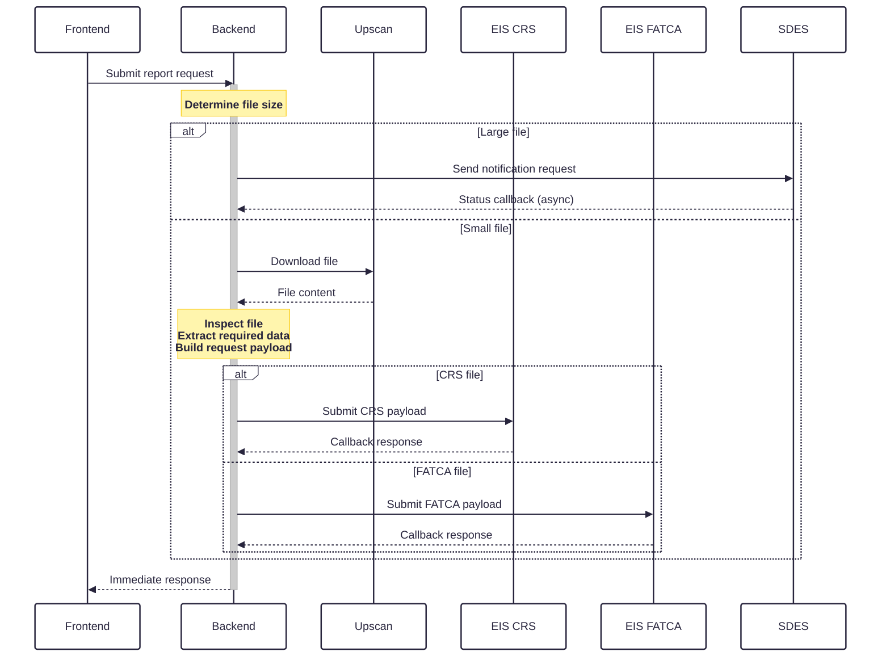

# crs-fatca-reporting

Backend service to support file uploads from crs & fatca.

The frontend to this service can be found [here](https://github.com/hmrc/crs-fatca-reporting-frontend)

---

### Running the service

Service manager: CRS_FATCA_ALL

**Port:** 10037

---
/validate-submission
### API

| Task                     | Supported methods | Description                                                |
|--------------------------|-------------------|------------------------------------------------------------|
| /callback                | POST              | Provides an endpoint for Upscan to reach after file upload |
| /upscan/details:uploadId | GET               | Uses the upload ID to find the details of the upload       |
| /upscan/status:uploadId  | GET               | Uses the upload ID to find the status of the upload        |
| /upscan/upload           | POST              | Requests an upload using Upscan                            |
| /validate-submission     | POST              | Validate file upload                                       |
---
### Upload sequence diagram

---

### License

This code is open source software licensed under the [Apache 2.0 License]("http://www.apache.org/licenses/LICENSE-2.0.html").
